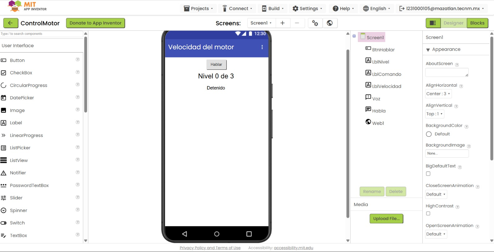
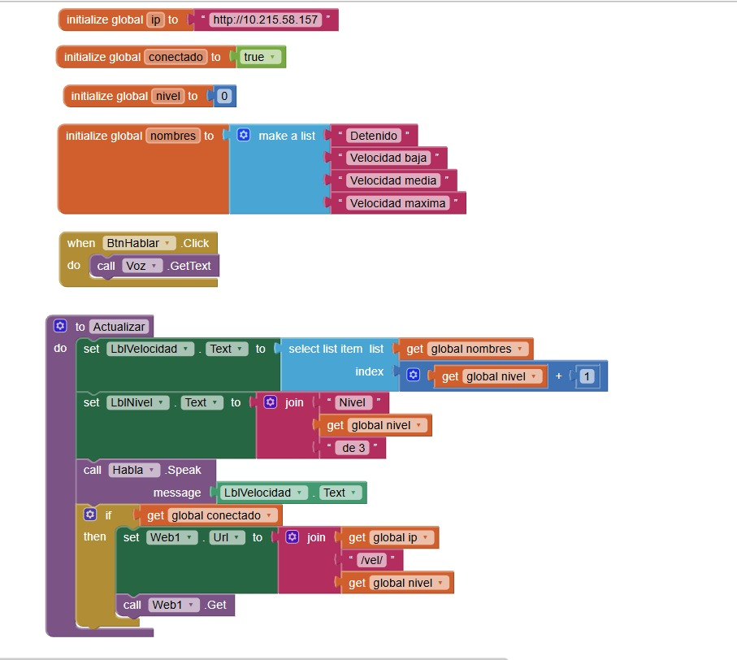
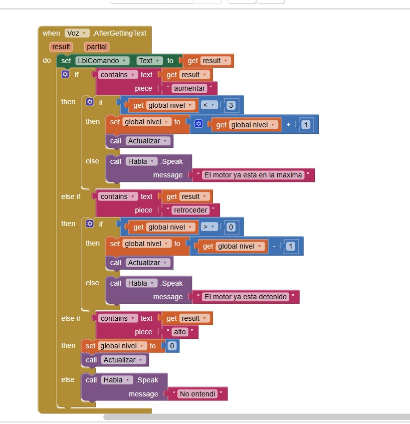

# Aplicación móvil — MIT App Inventor

Control por voz de la velocidad del motorreductor.

Comandos de voz: **aumentar / retroceder / alto**

Tres velocidades: baja → media → máxima.
Cada "aumentar" sube un escalón, cada "retroceder" baja uno.

La app funciona hoy sin Arduino: lleva la cuenta de la velocidad ella sola,
te la dice por voz y la muestra en pantalla.

---

## 1. Crear el proyecto

`ai2.appinventor.mit.edu` → Projects → Start new project → nombre: **ControlMotor**

---

## 2. Designer — componentes

| Paleta | Componente | Renombrar a | Propiedades a cambiar |
|---|---|---|---|
| User Interface | Button | `BtnHablar` | Text: **Hablar** |
| User Interface | Label | `LblVelocidad` | Text: **Detenido**, FontSize: **24**, FontBold: ✓ |
| User Interface | Label | `LblNivel` | Text: **Nivel 0 de 3**, FontSize: **16** |
| User Interface | Label | `LblComando` | Text: *(vacío)*, FontSize: **14**, TextColor: **Gray** |
| Media | SpeechRecognizer | `Voz` | — |
| Media | TextToSpeech | `Habla` | — |
| Connectivity | Web | `Web1` | — |

En `Screen1`: AppName = **ControlMotor**, Title = **Velocidad del motor**, AlignHorizontal = **Center**

Así queda el Designer con los 7 componentes:



---

## 3. Blocks

### Bloque A — variables globales

```
initialize global ip        to  " http://192.168.1.51 "
initialize global conectado to  false
initialize global nivel     to  0
initialize global nombres   to  make a list ( "Detenido" , "Velocidad baja" , "Velocidad media" , "Velocidad maxima" )
```

`make a list` está en la sección **Lists**.
Ojo: en App Inventor las listas empiezan en **1**, no en 0. Por eso más abajo
verás `nivel + 1` al buscar el nombre.

---

### Bloque B — el botón escucha

```
when BtnHablar.Click
    call Voz.GetText
```

---

### Bloque C — procedimiento que actualiza todo

De **Procedures** arrastra `to procedure do`, renómbralo **Actualizar**.
No lleva parámetros.

```
to Actualizar
do
    set LblVelocidad.Text to  select list item
                                  list:  get global nombres
                                  index: get global nivel + 1

    set LblNivel.Text     to  join( "Nivel " , get global nivel , " de 3" )

    call Habla.Speak      message: LblVelocidad.Text

    if  get global conectado
    then
        set Web1.Url to  join( get global ip , "/vel/" , get global nivel )
        call Web1.Get
```

`select list item` está en **Lists**.
`join` está en **Text** — puedes agregarle más huecos con el engranaje azul ⚙.
El bloque `+` está en **Math**.

Los bloques A, B y C ya armados:



En la captura las globales ya están apuntando al Arduino real: `ip` con la IP que
salió en el Monitor Serie y `conectado` en **true** (ver la sección 5).

---

### Bloque D — los comandos de voz

Arrastra `when Voz.AfterGettingText`. Adentro un `if` con **2 `else if`** y **1 `else`**.

```
when Voz.AfterGettingText (result, partial)
do
    set LblComando.Text to  get result

    if       contains  text: get result   piece: "aumentar"
    then     if   get global nivel < 3
             then set global nivel to  get global nivel + 1
                  call Actualizar
             else call Habla.Speak  message: "Ya esta en la maxima"

    else if  contains  text: get result   piece: "retroceder"
    then     if   get global nivel > 0
             then set global nivel to  get global nivel - 1
                  call Actualizar
             else call Habla.Speak  message: "El motor ya esta detenido"

    else if  contains  text: get result   piece: "alto"
    then     set global nivel to  0
             call Actualizar

    else     call Habla.Speak  message: "No te entendi"
```

Los bloques `<` y `>` están en **Math**.



> El `if` de adentro es lo que impide que se pase de 3 o baje de 0.
> Sin eso, `select list item` truena con un índice fuera de rango.

---

### Bloque E — respuesta del Arduino (para mañana)

```
when Web1.GotText (url, responseCode, responseType, responseContent)
do
    set LblComando.Text to  join( "Arduino: " , get responseContent )
```

---

### Bloque F — arrancar en cero (opcional pero recomendado)

```
when Screen1.Initialize
    set global nivel to  0
    set LblVelocidad.Text to  "Detenido"
    set LblNivel.Text     to  "Nivel 0 de 3"
```

Así la pantalla siempre abre consistente.

---

## 4. Probarlo hoy, sin Arduino

1. `Connect` → `AI Companion`, escanea el QR.
2. Toca **Hablar** y di: *"aumentar"* → debe decir **"Velocidad baja"**
3. Otra vez *"aumentar"* → **"Velocidad media"**
4. Otra vez → **"Velocidad maxima"**
5. Una cuarta vez → **"Ya está en la máxima"** (no se pasa)
6. *"retroceder"* → baja un escalón
7. *"alto"* → regresa a Detenido de golpe

Toda la lógica de las 3 velocidades vive en la app, así que puedes demostrarla
completa sin tener el hardware conectado.

---

## 5. Mañana, con el Arduino

1. Sube el código, mira la IP en el **Monitor Serie**.
2. Cambia en la app:
   - `initialize global ip` → la IP real
   - `initialize global conectado` → **true**

La app manda la URL `/vel/0`, `/vel/1`, `/vel/2` o `/vel/3` según el nivel.
El Arduino solo tiene que leer ese número y aplicar el PWM que le toque.

Ventaja de mandar el número directo en vez de "sube/baja": si se pierde un
comando por WiFi, el motor no se desincroniza de la pantalla.

---

## 6. Ajustar las palabras

Revisa `LblComando`: ahí sale el texto exacto que escuchó Google. Copia ese
texto al `piece` del `contains` que corresponda.

"Retroceder" a veces lo escucha como "retrocede". Puedes poner solo `"retroced"`
en el `piece` para atrapar las dos formas.

---

## Problemas comunes

| Síntoma | Causa |
|---|---|
| Error de índice al hablar | Falta el `if nivel < 3` / `nivel > 0`. Sin eso se sale de la lista. |
| Dice el nombre equivocado | Falta el `+ 1` en `select list item`. Las listas empiezan en 1. |
| No escucha | Emulador sin micrófono, o falta permiso de micrófono en Android. |
| Warning ⚠ | Algún hueco vacío. Usa las flechitas del contador para encontrarlo. |
