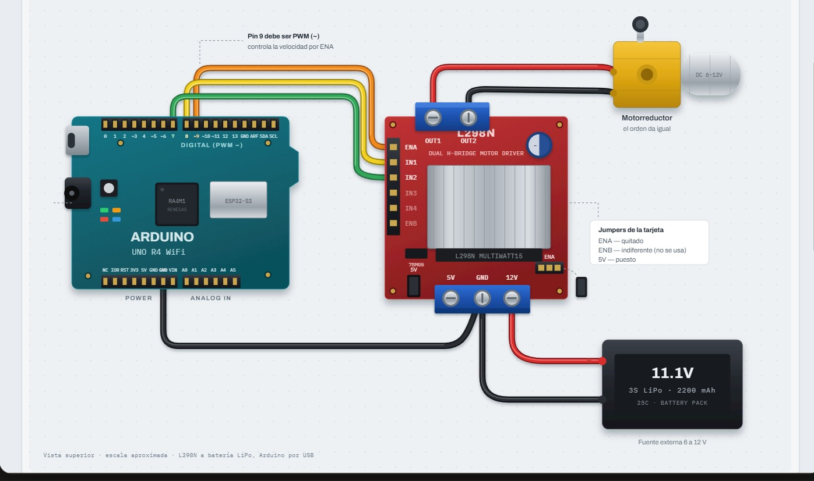
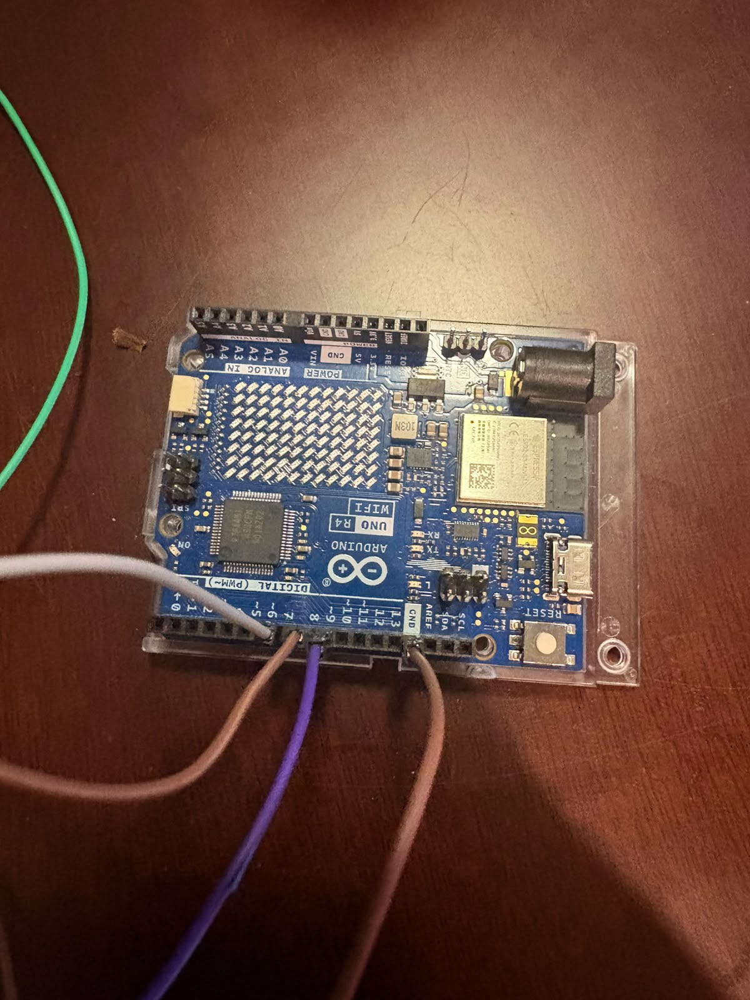
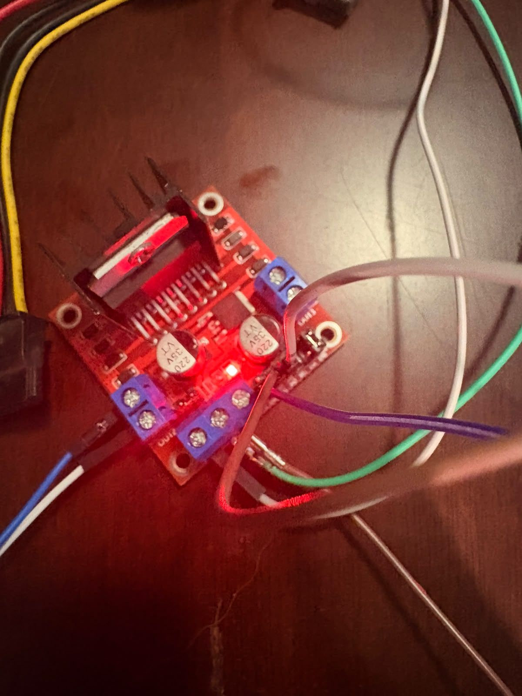
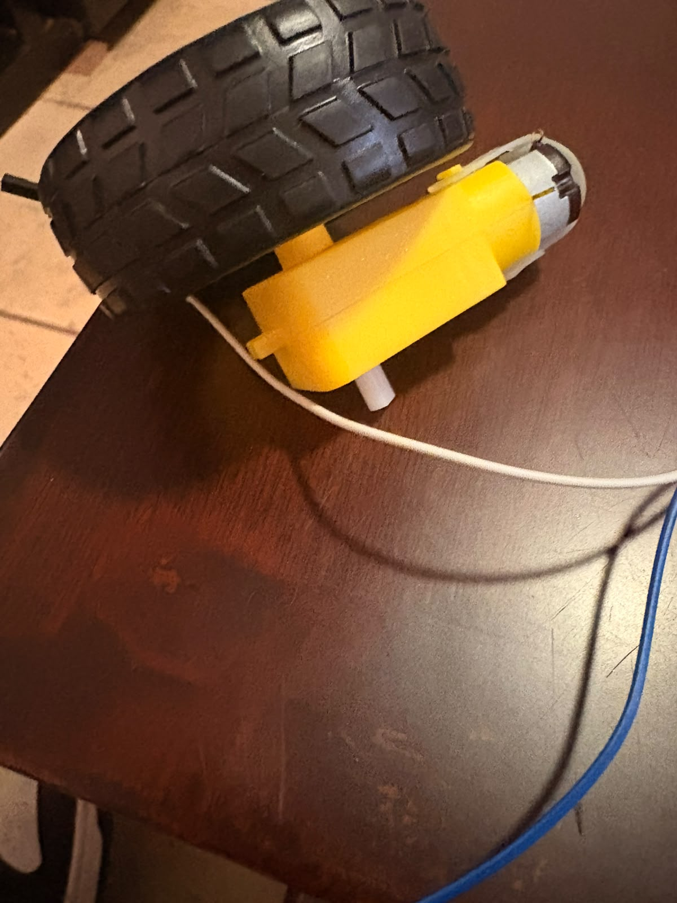

# Nombre del proyecto
Control de velocidad de un motorreductor en 3 niveles por comandos de voz

## Descripción
Una aplicación Android hecha en **MIT App Inventor** reconoce comandos de voz en
español y controla la velocidad de un motorreductor de CD en tres niveles, a través
de un **Arduino UNO R4 WiFi** y un **puente H L298N**.

La app no manda incrementos ("sube", "baja"), sino el **nivel absoluto** que debe
tener el motor (`/vel/0` a `/vel/3`). La cuenta del nivel la lleva la app; el Arduino
solo aplica el PWM que corresponde. Así, si una petición se pierde por la red, la
pantalla del celular y el motor no se desincronizan.

El puente H es necesario porque los pines del Arduino entregan unos 8 mA, muy por
debajo de lo que consume un motorreductor; el L298N actúa como interruptor de potencia
gobernado por señales de baja corriente.

El armado, la conexión a la red y la solución de problemas están en
[Guia-Hardware.md](Guia-Hardware.md).

## Objetivos de aprendizaje
- Variar la velocidad de un motor de CD modulando el ciclo de trabajo de una señal PWM
  aplicada al pin de habilitación (ENA) de un puente H.
- Controlar una carga inductiva de potencia desde un microcontrolador usando un L298N
  con fuente de alimentación independiente y tierra común.
- Diagnosticar por qué un motor no arranca a bajo PWM, distinguiendo una causa
  mecánica de una eléctrica: en esta práctica el síntoma parecía fricción del
  motorreductor, pero la causa real era la batería descargada.
- Diseñar un protocolo HTTP donde el cliente envía estado absoluto en lugar de
  incrementos, para tolerar la pérdida de peticiones.
- Validar rangos en la app (`if nivel < 3` / `if nivel > 0`) para evitar un índice
  fuera de rango en `select list item`.

## Material utilizado
- Arduino UNO R4 WiFi
- Puente H **L298N** (módulo con disipador)
- Motorreductor de CD
- Batería **LiPo 3S (11.1 V)** como fuente de potencia del motor
- Cables dupont macho-hembra
- Teléfono Android con la app **MIT AI2 Companion**
- Red Wi-Fi de 2.4 GHz (o hotspot del celular)

### Conexiones

| L298N | Conecta a | Nota |
|---|---|---|
| ENA | Arduino pin **9** | Entrada PWM. **Quitar el jumper de ENA** |
| IN1 | Arduino pin **8** | Sentido de giro |
| IN2 | Arduino pin **7** | Sentido de giro |
| GND | Arduino **GND** | **Tierra común, obligatoria** |
| +12V | Positivo de la batería LiPo | Fuente de potencia del motor |
| GND | Negativo de la batería | Mismo nodo que el GND del Arduino |
| OUT1 / OUT2 | Terminales del motorreductor | — |

Dos errores que impiden que funcione:

1. **Sin tierra común**, el L298N no tiene referencia para interpretar IN1, IN2 y ENA,
   y el motor no se mueve aunque todo lo demás esté bien.
2. **Con el jumper de ENA puesto**, ese pin queda fijo a 5 V y el módulo ignora la
   señal PWM: el motor gira siempre al máximo.

## Diagrama del circuito

Conexión Arduino UNO R4 WiFi / L298N / motorreductor / batería, con las notas de los
jumpers del módulo y del pin 9 (debe ser un pin PWM `~`):

## Código
[ControlMotor.ino](Codigo/ControlMotor.ino)

App móvil (MIT App Inventor): [Codigo/AppInventor](Codigo/AppInventor)
(ahí están las capturas del Designer y de los bloques)

### Rutas HTTP y niveles

| Ruta | Nivel | PWM | Respuesta del Arduino |
|---|---|---|---|
| `/vel/0` | Detenido | 0 | `detenido` |
| `/vel/1` | Baja | 130 | `velocidad baja` |
| `/vel/2` | Media | 190 | `velocidad media` |
| `/vel/3` | Máxima | 255 | `velocidad maxima` |

### Comandos de voz

| Se dice | Efecto |
|---|---|
| "aumentar" | Sube un escalón (tope en 3, avisa si ya está al máximo) |
| "retroceder" | Baja un escalón (piso en 0, avisa si ya está detenido) |
| "alto" | Regresa a nivel 0 de golpe |

### El motor no arrancaba a bajo PWM: causa real

Durante las primeras pruebas el motor no giraba en el nivel 1 (PWM 130): solo zumbaba.
La hipótesis inicial fue que el motorreductor no vencía la fricción de su caja de
engranes por debajo de un PWM cercano a 200, y por eso se agregó una **patada de
arranque** en `aplicarVelocidad()`: dar 255 durante 150 ms (`ARRANQUE_MS`) y luego bajar
al valor del nivel.

**Esa hipótesis resultó equivocada.** Tiempo después se identificó que la causa era la
**batería descargada**. Con la batería cargada, el motor arranca sin problema
directamente con el PWM 130 del nivel 1.

Por qué una batería baja produce justo ese síntoma:

- Al descargarse, una LiPo baja su voltaje **y sube su resistencia interna**. Bajo la
  corriente de arranque del motor, el voltaje se hunde todavía más.
- El PWM no reduce el voltaje: lo entrega a pulsos. En el nivel 1 el motor recibe el
  voltaje de la batería solo un 51 % del tiempo, así que el **par de arranque** es una
  fracción del total.
- Un par ya reducido por el PWM, aplicado sobre un voltaje ya caído, no alcanza a vencer
  la fricción estática. En el nivel 3 (PWM 255, siempre encendido) sí alcanzaba, y por
  eso el fallo parecía depender del nivel y no de la alimentación.

La patada de arranque se dejó en el código porque no estorba y da margen si la batería
va a media carga, pero **ya no es la solución al problema**: la solución es cargar la
batería. Antes de tocar `PWM[]` o `ARRANQUE_MS`, hay que medir el voltaje de la LiPo.

## Video del funcionamiento

[Readme](Video/Readme.txt)

[Ver video en YouTube](https://youtu.be/qG1_gLGx5YU)

## Evidencias de armado

Circuito completo: Arduino UNO R4 WiFi, L298N y motorreductor sobre la mesa de trabajo.

| Arduino UNO R4 WiFi | L298N energizado |
|---|---|
|  |  |
| Los cables salen de los pines **9**, **8**, **7** y **GND** | El LED rojo indica que la LiPo está alimentando el módulo |

Motorreductor con la llanta montada, la carga que mueve el circuito:

## Reporte
[Reporte de la practica.pdf](Reporte/Reporte%20de%20la%20practica.pdf)

Incluye:
- Datos generales, objetivo, tabla de conexiones y procedimiento
- Tabla de los tres niveles: PWM aplicado, ciclo de trabajo y velocidad observada
- Salida del Monitor Serie mostrando nivel y PWM en cada comando
- Observaciones sobre el comportamiento del sistema

## Conclusiones

<!-- PENDIENTE: redactar. Puntos que conviene tocar, salidos de la práctica real: -->
<!--                                                                              -->
<!-- - El diagnóstico equivocado: el motor no arrancaba en el nivel 1 y se        -->
<!--   atribuyó a la fricción del motorreductor, cuando la causa era la batería    -->
<!--   descargada. Se corrigió el síntoma (patada de arranque) antes de encontrar  -->
<!--   la causa. Vale la pena decir cómo se descubrió y qué se aprendió de eso:    -->
<!--   descartar primero la alimentación antes de calibrar el código.              -->
<!-- - El PWM no baja el voltaje, lo entrega a pulsos. Por eso una batería caída   -->
<!--   se nota solo en los niveles bajos: el par de arranque es una fracción del   -->
<!--   total y ya no alcanza a vencer la fricción estática.                        -->
<!-- - Por qué mandar el nivel absoluto y no incrementos: tolera peticiones        -->
<!--   perdidas sin que la pantalla y el motor se desincronicen.                   -->
<!-- - La tierra común y el jumper del ENA: dos fallas que no dan ningún error     -->
<!--   visible, solo un motor que no responde o que gira siempre al máximo.        -->
<!-- - La fuente del motor debe ser independiente: alimentarlo desde el Arduino    -->
<!--   provoca que la placa se reinicie al arrancar por la caída de tensión.       -->

## Resultados
[Resultados.pdf](Resultados/Resultados.pdf)

Resultados obtenidos en la práctica:

- Lo que se observó del sistema en cada nivel y con cada comando de voz
- Tabla PWM contra velocidad observada de los tres niveles
- Salida del Monitor Serie
