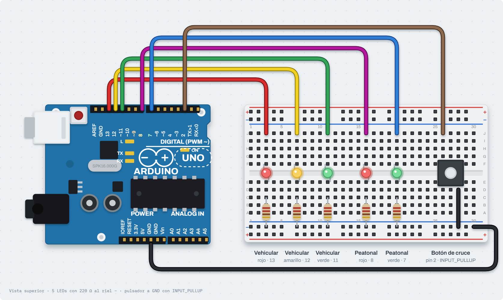
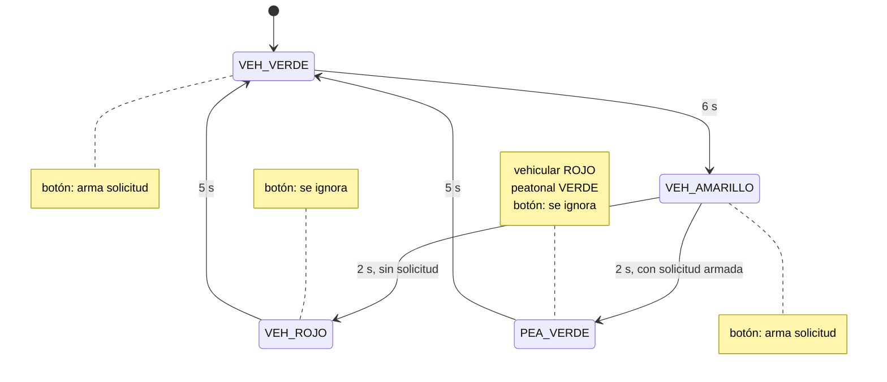
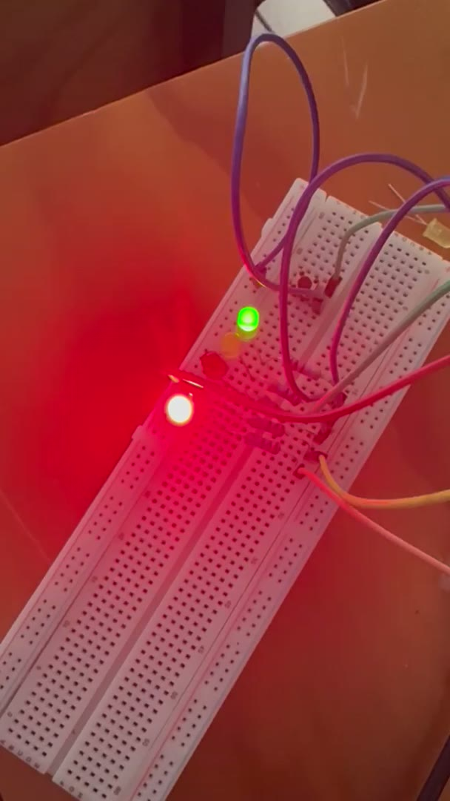
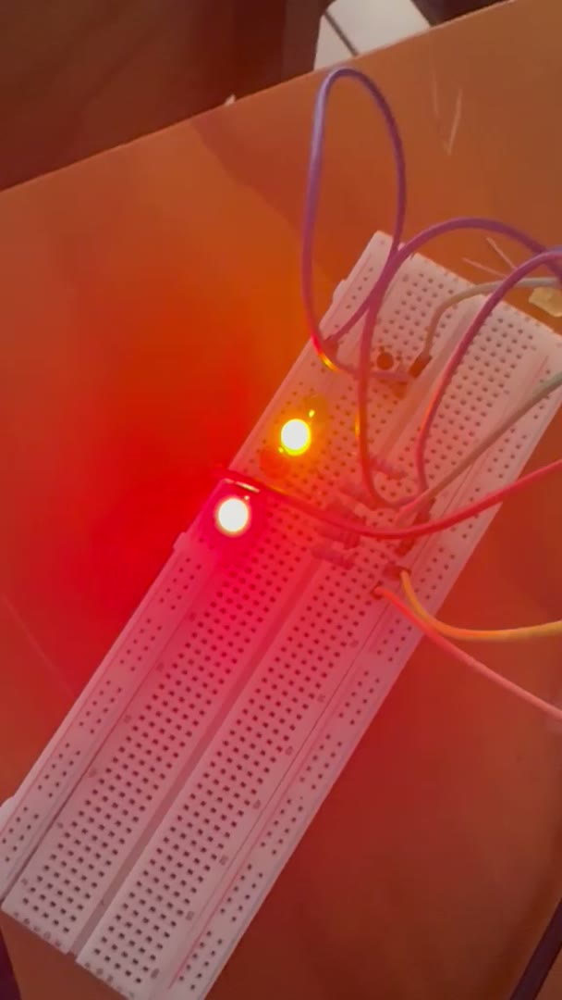
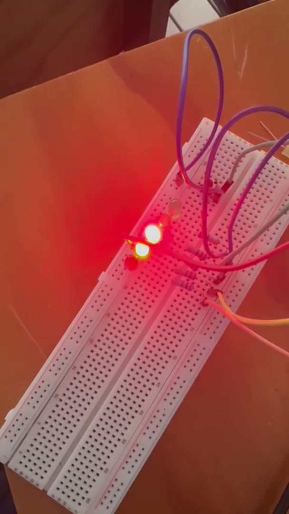

# Nombre del proyecto
Semáforo vehicular y peatonal con máquina de estados finitos (FSM)

## Descripción
Un semáforo vehicular de tres luces cicla solo: **VERDE → AMARILLO → ROJO → VERDE**.
Junto a él hay un semáforo peatonal de dos luces y un pulsador de cruce. El pulsador
no interrumpe nada de golpe: **arma una solicitud** que solo se acepta durante VERDE o
AMARILLO y se **atiende cuando el vehicular llega a ROJO**. En ese momento el peatonal
pasa a VERDE un tiempo fijo, regresa a ROJO y el ciclo vehicular reinicia. Si nadie
presiona el botón, el ciclo sigue sin detenerse a esperar a nadie.

Todo el programa está modelado como una **máquina de estados finitos** con cuatro
estados en un `enum class`, y la temporización es 100 % con `millis()`: no hay un solo
`delay()`, ni siquiera en el antirrebote del pulsador.

## Objetivos de aprendizaje
- Modelar un problema de control como FSM: estados, transiciones por tiempo y
  transiciones por evento (el botón), y llevarlo al código con un `switch` sobre el
  estado.
- Representar los estados con `enum class` y entender qué gana frente a un `enum`
  clásico: los valores quedan encapsulados (`Estado::VEH_ROJO`) y el compilador impide
  comparar estados de tipos distintos.
- Manejar una petición asíncrona (el peatón) sin romper la secuencia: la solicitud se
  "arma" y se atiende en el momento seguro.
- Leer un pulsador con antirrebote no bloqueante.
- Centralizar las salidas en una sola función (`aplicarSalidas`) para que las luces
  siempre correspondan al estado y nunca queden dos verdes encendidos.

## Material utilizado

| Cantidad | Material |
|---|---|
| 1 | Arduino UNO R4 WiFi |
| 3 | LEDs rojo, amarillo y verde — semáforo vehicular |
| 2 | LEDs rojo y verde — semáforo peatonal |
| 1 | Pulsador momentáneo normalmente abierto — botón de cruce |
| 5 | Resistencias de 220 Ω (una por LED) |
| 1 | Protoboard |
| — | Cables Dupont macho-macho |

El pulsador no necesita resistencia: se usa `INPUT_PULLUP` y el botón va del pin a GND.

### Conexiones

| Elemento | Pin Arduino | Nota |
|---|---|---|
| Vehicular VERDE | 11 | 220 Ω a GND |
| Vehicular AMARILLO | 12 | 220 Ω a GND |
| Vehicular ROJO | 13 | 220 Ω a GND |
| Peatonal ROJO | 8 | 220 Ω a GND |
| Peatonal VERDE | 7 | 220 Ω a GND |
| Pulsador | 2 | Otra pata a GND; `INPUT_PULLUP` (presionado = LOW) |

### Tiempos elegidos

| Fase | Duración | Constante |
|---|---|---|
| Vehicular VERDE | 6 s | `T_VERDE` |
| Vehicular AMARILLO | 2 s | `T_AMARILLO` (claramente más corto) |
| Vehicular ROJO sin peatón | 5 s | `T_ROJO` |
| Peatonal VERDE (vehicular en rojo) | 5 s | `T_PEATON` |
| Antirrebote del botón | 40 ms | `T_REBOTE` |

## Diagrama del circuito



```
Pin 11 ──┤>├ verde    ──[220 Ω]──┐
Pin 12 ──┤>├ amarillo ──[220 Ω]──┤   semáforo vehicular
Pin 13 ──┤>├ rojo     ──[220 Ω]──┤
Pin 8  ──┤>├ rojo     ──[220 Ω]──┤   semáforo peatonal
Pin 7  ──┤>├ verde    ──[220 Ω]──┤
Pin 2  ───[ pulsador ]───────────┴── GND
```

### Diagrama de estados



| Estado | Vehicular | Peatonal | Sale cuando |
|---|---|---|---|
| `VEH_VERDE` | verde | rojo | pasan 6 s → `VEH_AMARILLO` |
| `VEH_AMARILLO` | amarillo | rojo | pasan 2 s → `PEA_VERDE` si hay solicitud, si no `VEH_ROJO` |
| `VEH_ROJO` | rojo | rojo | pasan 5 s → `VEH_VERDE` |
| `PEA_VERDE` | rojo | verde | pasan 5 s → `VEH_VERDE` |

## Código
[SemaforoFSM.ino](Codigo/SemaforoFSM/SemaforoFSM.ino)

### Los estados

```cpp
enum class Estado {
  VEH_VERDE,     // vehicular verde,    peatonal rojo
  VEH_AMARILLO,  // vehicular amarillo, peatonal rojo
  VEH_ROJO,      // vehicular rojo,     peatonal rojo (sin solicitud)
  PEA_VERDE      // vehicular rojo,     peatonal verde (atendiendo la solicitud)
};
```

Con `enum class` hay que escribir `Estado::VEH_ROJO`; un `if (estado == 2)` o una
comparación contra otro enum no compila. Con un `enum` clásico eso pasaría en silencio.

### Cómo se atiende al peatón sin romper el ciclo

1. El `loop()` lee el botón con antirrebote no bloqueante (`botonPresionado()`).
2. Si el estado es `VEH_VERDE` o `VEH_AMARILLO`, pone `solicitudPeatonal = true`. En
   cualquier otro estado la pulsación se ignora y se avisa por serial.
3. Al terminar `VEH_AMARILLO` se decide la transición: con solicitud armada va a
   `PEA_VERDE` (vehicular rojo + peatonal verde 5 s); sin ella va a `VEH_ROJO` normal.
4. Desde cualquiera de los dos se regresa a `VEH_VERDE` y el ciclo continúa.

Las cinco luces las escribe solo `aplicarSalidas(estado)`, que se llama en cada cambio
de estado. Así es imposible que el peatonal esté en verde mientras el vehicular no
está en rojo.

### Salida del Monitor Serie (9600 baudios)

Cada transición imprime el instante y el estado nuevo, lo que sirve para verificar
los tiempos sin cronómetro:

```
Semaforo FSM (sin delay)
0 ms  -> VEH_VERDE
3210 ms  boton: solicitud peatonal ARMADA, se atiende en rojo
6000 ms  -> VEH_AMARILLO  (solicitud peatonal armada)
8000 ms  -> PEA_VERDE
13000 ms  -> VEH_VERDE
19000 ms  -> VEH_AMARILLO
21000 ms  -> VEH_ROJO
22500 ms  boton ignorado (fuera de verde/amarillo)
26000 ms  -> VEH_VERDE
```

## Video del funcionamiento

[](https://youtube.com/shorts/jQlzccY6zho)

**YouTube:** https://youtube.com/shorts/jQlzccY6zho

Copia local: [Video/semaforo-fsm.mp4](Video/semaforo-fsm.mp4) · [Readme](Video/Readme.txt)

## Evidencias de armado

Cuadros tomados del video del funcionamiento:

| | | |
|---|---|---|
|  |  |  |

## Reporte
[Reporte de la práctica — Semáforo FSM (PDF)](Reporte/Reporte-Semaforo-FSM.pdf) · [qué contiene la carpeta](Reporte/Readme.txt)

Incluye:
- Datos generales, objetivo, tabla de conexiones, tiempos y procedimiento
- Tabla de estados de la FSM y tabla de pruebas (pulsar en verde, amarillo, rojo, cruce, doble pulsación)
- Salida del Monitor Serie con el instante de cada transición
- Observaciones, conclusiones y evidencia del armado

## Conclusiones

Pensar el semáforo como máquina de estados antes de programarlo simplifica todo: cada estado dice qué luces van encendidas y qué lo saca de ahí, y el código termina siendo la tabla de transiciones escrita como un `switch`. Agregar un estado (por ejemplo un parpadeo del peatonal antes de terminar) es agregar un renglón a esa tabla, no reescribir el programa.

`enum class` en lugar de `enum` clásico evita errores concretos: no se puede comparar el estado contra un número suelto ni contra otro enum sin que el compilador lo rechace, y los nombres quedan encapsulados (`Estado::VEH_ROJO`). Un error que con `enum` pasaría en silencio aquí no compila.

La solicitud "armada" es la pieza clave: el botón no cambia de estado en el instante en que se pulsa, solo levanta una bandera que se atiende en el momento seguro (al terminar el amarillo). Así el vehicular nunca pasa de verde a rojo de golpe, y es imposible que los dos semáforos estén en verde al mismo tiempo porque las cinco luces las escribe una sola función a partir del estado.

Todo con `millis()` permite leer el botón en cada vuelta del `loop()`; con `delay()` la pulsación se perdería mientras el programa espera los 6 s del verde. El antirrebote también es no bloqueante, así que el semáforo nunca deja de atender el tiempo.

Se probó pulsar en verde, en amarillo, en rojo y no pulsar. En los dos primeros casos se atiende el cruce al llegar a rojo; en rojo se ignora; sin pulsar, el ciclo sigue solo. El Monitor Serie con el instante de cada transición fue suficiente para comprobar los tiempos sin cronómetro.

## Resultados
[Resultados de la práctica — Semáforo FSM (PDF)](Resultados/Resultados-Semaforo-FSM.pdf) · [qué contiene la carpeta](Resultados/Readme.txt)

Resultados obtenidos en la práctica:

- El ciclo vehicular 6 / 2 / 5 s corre solo y el peatonal se atiende únicamente al llegar a rojo
- Tabla de pruebas: botón en verde, amarillo, rojo, durante el cruce, doble pulsación y antirrebote
- Salida del Monitor Serie: los instantes de transición coinciden con las constantes del programa
