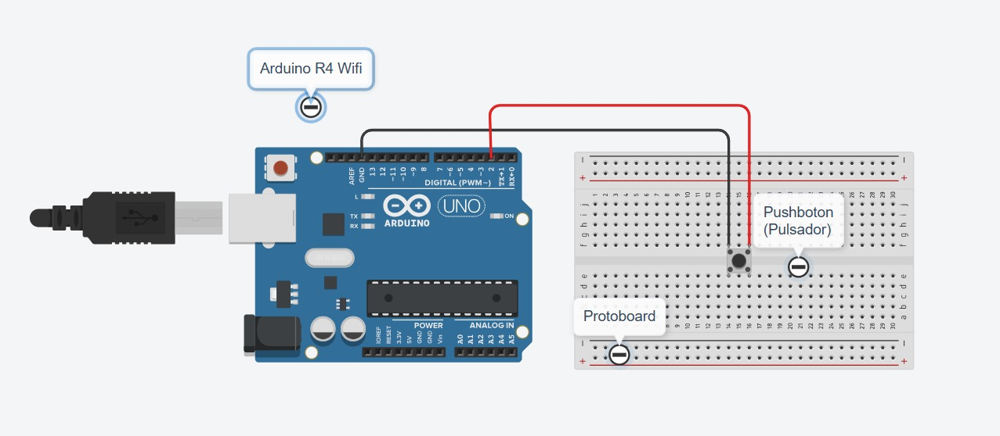
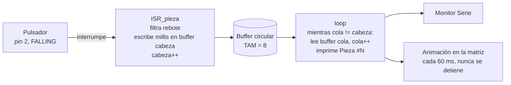
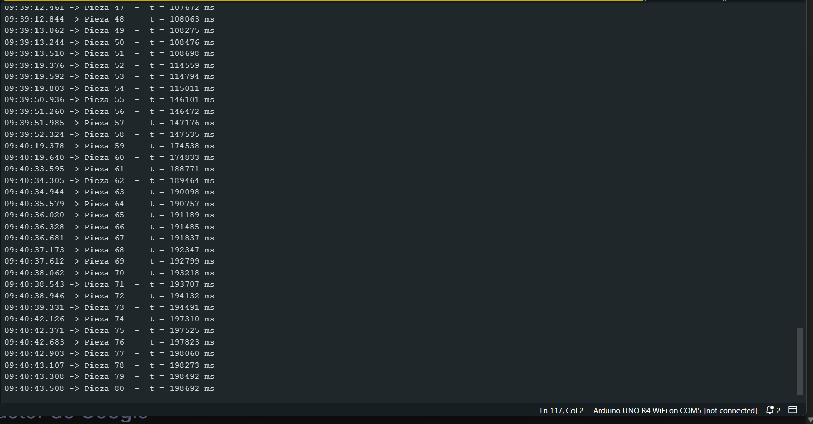

# Nombre del proyecto
Buffer circular alimentado por interrupción externa (contador de piezas)

## Descripción
Se simula el sensor de piezas de una **banda transportadora**: cada vez que pasa una
pieza, el sensor (aquí un pulsador) avisa al Arduino. Las piezas pasan en cualquier
momento y, mientras tanto, el Arduino está ocupado dibujando una **animación en la
matriz de LEDs** del UNO R4 WiFi. El objetivo es que **no se pierda ninguna pieza**
aunque el pulsador se presione muy rápido y muchas veces seguidas, y que la animación
**nunca se detenga**.

La solución separa dos ritmos que no se esperan el uno al otro:

- El pulsador va en un **pin de interrupción externa**. Al presionarlo, el Arduino
  interrumpe lo que esté haciendo y salta a una ISR que solo **anota el instante** en
  una "libreta" de tamaño fijo y sale (microsegundos).
- Esa libreta es un **buffer circular**: al llegar al final se regresa al principio.
- El `loop()` sigue con la animación y, en cada vuelta, revisa si hay anotaciones
  nuevas y las procesa una por una, imprimiendo por serial "van N piezas".

## Objetivos de aprendizaje
- Usar `attachInterrupt()` y entender qué puede y qué **no** puede hacer una ISR
  (nada de `Serial`, `delay()` ni cálculos largos: mientras corre, todo lo demás
  está pausado).
- Implementar un buffer circular con dos índices (`cabeza` para escribir, `cola`
  para leer) y **resolver la ambigüedad lleno/vacío**, donde ambos índices pueden
  apuntar al mismo lugar.
- Filtrar el rebote del pulsador **dentro de la ISR**, que es distinto al antirrebote
  del `loop()` porque la interrupción reacciona a cada flanco.
- Entender el patrón **productor–consumidor**: la ISR produce, el `loop()` consume, y
  el buffer es el punto de encuentro sin que ninguno espere al otro.
- Usar `volatile` para las variables compartidas entre la ISR y el `loop()`.

## Material utilizado

| Cantidad | Material |
|---|---|
| 1 | Arduino UNO R4 WiFi (trae la matriz de 12×8 LEDs integrada) |
| 1 | Pulsador momentáneo normalmente abierto — simula el sensor de piezas |
| 1 | Protoboard |
| — | Cables Dupont macho-macho |
| 1 | Cable USB-C para el Monitor Serie |

El pulsador no necesita resistencia: se usa `INPUT_PULLUP` y va del pin a GND. No hay
LEDs externos: la animación se dibuja en la matriz integrada de la placa.

### Conexiones

| Elemento | Pin Arduino | Nota |
|---|---|---|
| Pulsador (sensor de piezas) | 2 | Otra pata a GND; `INPUT_PULLUP`, interrupción en flanco `FALLING` |
| Matriz de LEDs | — | Integrada en el UNO R4 WiFi, se maneja con `Arduino_LED_Matrix` |

En el UNO R4 WiFi cualquier pin digital acepta `attachInterrupt()`, pero se usa el
pin 2 por ser el pin de interrupción "clásico" (INT0) y compatible con el UNO R3.

### Parámetros elegidos

| Parámetro | Valor | Constante |
|---|---|---|
| Tamaño del buffer | 8 lugares (7 útiles) | `TAM_BUFFER` |
| Antirrebote dentro de la ISR | 50 ms | `T_REBOTE` |
| Cuadro de animación | cada 60 ms | `T_ANIMACION` |
| Reporte de estado por serial | cada 5 s | `T_ESTADO` |

El buffer es pequeño **a propósito** para poder llenarlo a mano y ver cómo se
comporta cuando se desborda (ver la sección de resultados).

## Diagrama del circuito



Diagrama hecho en Tinkercad: el pulsador va en la protoboard, una pata al **pin 2** y la
otra a **GND**. No lleva resistencia porque el pin usa `INPUT_PULLUP`.

```
Pin 2 ───[ pulsador ]─── GND        (INPUT_PULLUP: presionado = LOW)

          ┌────────────────┐
          │ ○○○○○○○○○○○○   │   matriz 12x8 integrada
          │ ○          ○   │   (una "pieza" recorre el borde)
          │ ○          ○   │
          │ ○○○○○○○○○○○○   │
          └────────────────┘
```

### Flujo de datos



### El buffer circular: lleno vs. vacío

Con dos índices que dan vueltas, `cabeza == cola` puede significar tanto "no hay nada"
como "está completamente lleno". Se sacrifica **un hueco**:

```
Vacío:   cabeza == cola
Lleno:   (cabeza + 1) % TAM == cola      → capacidad útil = TAM - 1
```

Esto tiene una ventaja extra: la ISR **solo escribe `cabeza`** y el `loop()` **solo
escribe `cola`**. Como cada índice tiene un único dueño, no hace falta apagar las
interrupciones para leer el buffer y no hay condiciones de carrera.

Ejemplo con `TAM = 8` después de anotar 5 piezas y haber leído 2:

```
  índice:    0     1     2     3     4     5     6     7
          [ t1 ][ t2 ][ t3 ][ t4 ][ t5 ][    ][    ][    ]
                       ↑                 ↑
                     cola              cabeza
              (siguiente por leer)  (siguiente por escribir)

  pendientes = (cabeza - cola + TAM) % TAM = (5 - 2 + 8) % 8 = 3   → t3, t4, t5
```

`cola` avanza cuando el `loop()` procesa; `cabeza` avanza cuando la ISR anota. Cuando
cualquiera llega al índice 7, el siguiente es el 0: por eso es "circular".

Cuando el buffer está lleno, la ISR **no pisa** lo que el `loop()` aún no ha leído:
descarta la pieza nueva y aumenta el contador `perdidas`, que sale en el reporte de
estado. Así se detecta si el buffer se quedó corto en vez de perder datos en silencio.

## Código
[BufferCircularISR.ino](Codigo/BufferCircularISR.ino)

### La ISR: lo mínimo posible

```cpp
void ISR_pieza() {
  unsigned long ahora = millis();
  if (ahora - ultimoFlanco < T_REBOTE) return;   // rebote del mismo clic: se ignora
  ultimoFlanco = ahora;

  if (bufferLleno()) {        // no se pisa lo que el loop() aun no leyo
    perdidas++;
    return;
  }
  buffer[cabeza] = ahora;
  cabeza = (cabeza + 1) % TAM_BUFFER;
}
```

Sin `Serial.print`, sin `delay()`, sin ciclos. Solo lee `millis()`, compara, escribe
en un arreglo y avanza un índice. Todo lo que comparte con el `loop()` es `volatile`.

**Antirrebote en la ISR:** un pulsador mecánico vibra varias veces en los primeros
milisegundos, y cada vibración es un flanco `FALLING` que dispararía la ISR. Se guarda
el instante del último flanco aceptado y se ignoran los que lleguen antes de
`T_REBOTE` ms. A diferencia del antirrebote del `loop()` (que espera a que la lectura
se estabilice), aquí no se puede esperar: se acepta el primer flanco y se descartan
los que vienen pegados.

### El loop(): consume sin bloquear

```cpp
while (!bufferVacio()) {
  unsigned long t = buffer[cola];
  cola = (cola + 1) % TAM_BUFFER;   // el loop() es el unico que mueve la cola
  piezas++;
  Serial.print("Pieza #"); Serial.print(piezas); ...
}
```

Si no hay nada nuevo, el `while` no entra y el `loop()` sigue con la animación sin
detenerse. Si hubo una ráfaga de pulsaciones mientras se dibujaba un cuadro, se
procesan todas de golpe en la siguiente vuelta.

### La animación

Una "pieza" de 3 LEDs recorre el borde de la matriz (36 posiciones) avanzando un
lugar cada 60 ms con `millis()`. Se usa la librería `Arduino_LED_Matrix` que viene
con el núcleo del UNO R4 y `renderBitmap()` con un arreglo `uint8_t[8][12]`.

### Salida del Monitor Serie (9600 baudios)

Captura real de una sesión de 80 pulsaciones (se muestran las piezas 47 a 80). `t` es el
`millis()` que anotó la ISR en el instante de la pulsación:



```
Pieza 47  -  t = 107672 ms
Pieza 48  -  t = 108063 ms   (+391 ms)
Pieza 49  -  t = 108275 ms   (+212 ms)
Pieza 50  -  t = 108476 ms   (+201 ms)
Pieza 51  -  t = 108698 ms   (+222 ms)
Pieza 52  -  t = 114559 ms   (+5861 ms)  <- pausa de 6 s, ninguna pieza fantasma
...
Pieza 73  -  t = 194491 ms
Pieza 74  -  t = 197310 ms   (+2819 ms)
Pieza 75  -  t = 197525 ms   (+215 ms)   <- rafaga: 7 pulsaciones en 1.4 s
Pieza 76  -  t = 197823 ms   (+298 ms)
Pieza 77  -  t = 198060 ms   (+237 ms)
Pieza 78  -  t = 198273 ms   (+213 ms)
Pieza 79  -  t = 198492 ms   (+219 ms)
Pieza 80  -  t = 198692 ms   (+200 ms)
```

El intervalo entre piezas es la diferencia entre los `millis()` que anotó la ISR, no entre
los `Serial.print`: por eso mide el momento real en que pasó la pieza aunque el `loop()`
la procese después. En toda la captura la numeración avanza de uno en uno: ninguna
pulsación se perdió ni se contó doble. Captura completa en [Terminal/](Terminal/Readme.txt).

## Video del funcionamiento

[](https://youtube.com/shorts/ujhbv712WJ4)

**YouTube:** https://youtube.com/shorts/ujhbv712WJ4 · [Readme](Video/Readme.txt)

## Evidencias

| Diagrama (Tinkercad) | Monitor Serie |
|---|---|
|  |  |

## Reporte
[Reporte de la práctica — Buffer circular con ISR (PDF)](Reporte/Reporte-Buffer-Circular-ISR.pdf) · [qué contiene la carpeta](Reporte/Readme.txt)

Incluye:
- Datos generales, objetivo, tabla de conexiones, parámetros y procedimiento
- Tabla de pruebas (pulsaciones lentas, pausas largas, ráfaga media, ráfaga rápida, rebote, desborde, animación)
- Tabla de intervalos calculados a partir de la captura del Monitor Serie
- Captura del Monitor Serie, observaciones, conclusiones y evidencias

## Conclusiones

La interrupción externa resuelve un problema que el sondeo en el `loop()` no puede: atender un evento en el instante en que ocurre, sin importar qué esté haciendo el programa. Con un `loop()` ocupado dibujando la matriz, leer el pulsador con `digitalRead()` habría perdido pulsaciones cortas; con `attachInterrupt()` la ISR se ejecutó siempre, y la captura de 80 piezas consecutivas lo confirma.

La regla de oro de la ISR es hacer lo mínimo: leer `millis()`, comparar, escribir en un arreglo y avanzar un índice. Todo lo lento (`Serial`, animación) se queda en el `loop()`. Si se pusiera un `Serial.print` dentro de la ISR, cada pulsación congelaría la animación varios milisegundos y, peor, `Serial` depende de interrupciones que están deshabilitadas mientras la ISR corre. Ese reparto es lo que permitió que la animación nunca se detuviera aunque se pulsara en ráfaga.

El buffer circular es el punto de encuentro entre dos ritmos distintos: la ISR produce cuando quiere y el `loop()` consume cuando puede. Se resolvió lleno vs. vacío sacrificando un hueco (`(cabeza + 1) % TAM == cola` es lleno); las otras opciones —un contador de elementos o una bandera "lleno"— obligan a que ISR y `loop()` escriban la misma variable y entonces sí habría que bloquear interrupciones. Con un índice por dueño no hubo condiciones de carrera.

El antirrebote dentro de una ISR es distinto al del `loop()`: no se puede esperar a que la señal se estabilice, así que se acepta el primer flanco y se ignoran los que lleguen en los siguientes 50 ms. Funcionó sin dobles conteos en ninguna de las ráfagas.

Se probaron pulsaciones lentas, pausas de hasta 31 s y ráfagas de 7 pulsaciones en 1.4 s (una cada 200–300 ms). No se logró llenar el buffer a mano: el `loop()` lo vacía en microsegundos y `perdidas` se quedó en 0; el tamaño de 8 sirvió para verificar la lógica, no como límite real. `volatile` es obligatorio en todo lo compartido con la ISR: sin él el compilador puede optimizar la lectura de `cabeza` en el `while` y el `loop()` nunca vería las piezas nuevas.

## Resultados
[Resultados de la práctica — Buffer circular con ISR (PDF)](Resultados/Resultados-Buffer-Circular-ISR.pdf) · [qué contiene la carpeta](Resultados/Readme.txt)

Resultados obtenidos en la práctica:

- Contador de piezas por interrupción externa funcionando: 80 pulsaciones registradas sin saltos ni repeticiones
- Ráfaga de 7 pulsaciones en 1.4 s (200–300 ms entre cada una) capturada completa por la ISR
- Pausas de hasta 31 s sin ninguna pieza fantasma; antirrebote de 50 ms sin dobles conteos
- Buffer circular de 8 lugares (7 útiles) con lógica lleno/vacío verificada; `perdidas = 0` en todas las pruebas
- Animación en la matriz de 12×8 LEDs continua durante todas las pruebas, sin trabarse al pulsar
