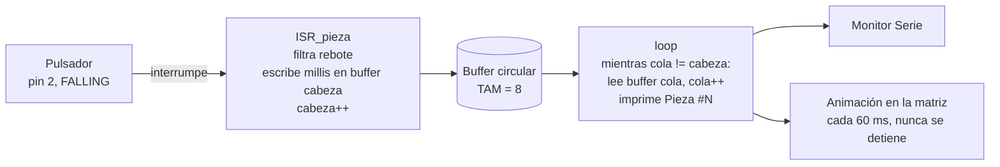

# Nombre del proyecto
Buffer circular alimentado por interrupción externa (contador de piezas)

## Descripción
Se simula el sensor de piezas de una **banda transportadora**: cada vez que pasa una
pieza, el sensor (aquí un pulsador) avisa al Arduino. Las piezas pasan en cualquier
momento y, mientras tanto, el Arduino está ocupado dibujando una **animación en la
matriz de LEDs** del UNO R4 WiFi. El objetivo es que **no se pierda ninguna pieza**
aunque el pulsador se presione muy rápido y muchas veces seguidas, y que la animación
**nunca se detenga**.

La solución separa dos ritmos que no se esperan el uno al otro:

- El pulsador va en un **pin de interrupción externa**. Al presionarlo, el Arduino
  interrumpe lo que esté haciendo y salta a una ISR que solo **anota el instante** en
  una "libreta" de tamaño fijo y sale (microsegundos).
- Esa libreta es un **buffer circular**: al llegar al final se regresa al principio.
- El `loop()` sigue con la animación y, en cada vuelta, revisa si hay anotaciones
  nuevas y las procesa una por una, imprimiendo por serial "van N piezas".

## Objetivos de aprendizaje
- Usar `attachInterrupt()` y entender qué puede y qué **no** puede hacer una ISR
  (nada de `Serial`, `delay()` ni cálculos largos: mientras corre, todo lo demás
  está pausado).
- Implementar un buffer circular con dos índices (`cabeza` para escribir, `cola`
  para leer) y **resolver la ambigüedad lleno/vacío**, donde ambos índices pueden
  apuntar al mismo lugar.
- Filtrar el rebote del pulsador **dentro de la ISR**, que es distinto al antirrebote
  del `loop()` porque la interrupción reacciona a cada flanco.
- Entender el patrón **productor–consumidor**: la ISR produce, el `loop()` consume, y
  el buffer es el punto de encuentro sin que ninguno espere al otro.
- Usar `volatile` para las variables compartidas entre la ISR y el `loop()`.

## Material utilizado

| Cantidad | Material |
|---|---|
| 1 | Arduino UNO R4 WiFi (trae la matriz de 12×8 LEDs integrada) |
| 1 | Pulsador momentáneo normalmente abierto — simula el sensor de piezas |
| 1 | Protoboard |
| — | Cables Dupont macho-macho |
| 1 | Cable USB-C para el Monitor Serie |

El pulsador no necesita resistencia: se usa `INPUT_PULLUP` y va del pin a GND. No hay
LEDs externos: la animación se dibuja en la matriz integrada de la placa.

### Conexiones

| Elemento | Pin Arduino | Nota |
|---|---|---|
| Pulsador (sensor de piezas) | 2 | Otra pata a GND; `INPUT_PULLUP`, interrupción en flanco `FALLING` |
| Matriz de LEDs | — | Integrada en el UNO R4 WiFi, se maneja con `Arduino_LED_Matrix` |

En el UNO R4 WiFi cualquier pin digital acepta `attachInterrupt()`, pero se usa el
pin 2 por ser el pin de interrupción "clásico" (INT0) y compatible con el UNO R3.

### Parámetros elegidos

| Parámetro | Valor | Constante |
|---|---|---|
| Tamaño del buffer | 8 lugares (7 útiles) | `TAM_BUFFER` |
| Antirrebote dentro de la ISR | 50 ms | `T_REBOTE` |
| Cuadro de animación | cada 60 ms | `T_ANIMACION` |
| Reporte de estado por serial | cada 5 s | `T_ESTADO` |

El buffer es pequeño **a propósito** para poder llenarlo a mano y ver cómo se
comporta cuando se desborda (ver la sección de resultados).

## Diagrama del circuito

<!-- PENDIENTE: foto del armado en la protoboard. Ver Diagrama/Readme.txt -->

```
Pin 2 ───[ pulsador ]─── GND        (INPUT_PULLUP: presionado = LOW)

          ┌────────────────┐
          │ ○○○○○○○○○○○○   │   matriz 12x8 integrada
          │ ○          ○   │   (una "pieza" recorre el borde)
          │ ○          ○   │
          │ ○○○○○○○○○○○○   │
          └────────────────┘
```

### Flujo de datos



### El buffer circular: lleno vs. vacío

Con dos índices que dan vueltas, `cabeza == cola` puede significar tanto "no hay nada"
como "está completamente lleno". Se sacrifica **un hueco**:

```
Vacío:   cabeza == cola
Lleno:   (cabeza + 1) % TAM == cola      → capacidad útil = TAM - 1
```

Esto tiene una ventaja extra: la ISR **solo escribe `cabeza`** y el `loop()` **solo
escribe `cola`**. Como cada índice tiene un único dueño, no hace falta apagar las
interrupciones para leer el buffer y no hay condiciones de carrera.

Ejemplo con `TAM = 8` después de anotar 5 piezas y haber leído 2:

```
  índice:    0     1     2     3     4     5     6     7
          [ t1 ][ t2 ][ t3 ][ t4 ][ t5 ][    ][    ][    ]
                       ↑                 ↑
                     cola              cabeza
              (siguiente por leer)  (siguiente por escribir)

  pendientes = (cabeza - cola + TAM) % TAM = (5 - 2 + 8) % 8 = 3   → t3, t4, t5
```

`cola` avanza cuando el `loop()` procesa; `cabeza` avanza cuando la ISR anota. Cuando
cualquiera llega al índice 7, el siguiente es el 0: por eso es "circular".

Cuando el buffer está lleno, la ISR **no pisa** lo que el `loop()` aún no ha leído:
descarta la pieza nueva y aumenta el contador `perdidas`, que sale en el reporte de
estado. Así se detecta si el buffer se quedó corto en vez de perder datos en silencio.

## Código
[BufferCircularISR.ino](Codigo/BufferCircularISR/BufferCircularISR.ino)

### La ISR: lo mínimo posible

```cpp
void ISR_pieza() {
  unsigned long ahora = millis();
  if (ahora - ultimoFlanco < T_REBOTE) return;   // rebote del mismo clic: se ignora
  ultimoFlanco = ahora;

  if (bufferLleno()) {        // no se pisa lo que el loop() aun no leyo
    perdidas++;
    return;
  }
  buffer[cabeza] = ahora;
  cabeza = (cabeza + 1) % TAM_BUFFER;
}
```

Sin `Serial.print`, sin `delay()`, sin ciclos. Solo lee `millis()`, compara, escribe
en un arreglo y avanza un índice. Todo lo que comparte con el `loop()` es `volatile`.

**Antirrebote en la ISR:** un pulsador mecánico vibra varias veces en los primeros
milisegundos, y cada vibración es un flanco `FALLING` que dispararía la ISR. Se guarda
el instante del último flanco aceptado y se ignoran los que lleguen antes de
`T_REBOTE` ms. A diferencia del antirrebote del `loop()` (que espera a que la lectura
se estabilice), aquí no se puede esperar: se acepta el primer flanco y se descartan
los que vienen pegados.

### El loop(): consume sin bloquear

```cpp
while (!bufferVacio()) {
  unsigned long t = buffer[cola];
  cola = (cola + 1) % TAM_BUFFER;   // el loop() es el unico que mueve la cola
  piezas++;
  Serial.print("Pieza #"); Serial.print(piezas); ...
}
```

Si no hay nada nuevo, el `while` no entra y el `loop()` sigue con la animación sin
detenerse. Si hubo una ráfaga de pulsaciones mientras se dibujaba un cuadro, se
procesan todas de golpe en la siguiente vuelta.

### La animación

Una "pieza" de 3 LEDs recorre el borde de la matriz (36 posiciones) avanzando un
lugar cada 60 ms con `millis()`. Se usa la librería `Arduino_LED_Matrix` que viene
con el núcleo del UNO R4 y `renderBitmap()` con un arreglo `uint8_t[8][12]`.

### Salida del Monitor Serie (9600 baudios)

```
Buffer circular por interrupcion
TAM_BUFFER = 8  (capacidad util 7)
Pieza #1  t = 2314 ms
Pieza #2  t = 2890 ms  (+576 ms)
Pieza #3  t = 3102 ms  (+212 ms)
[estado] piezas: 3  pendientes: 0/7  perdidas: 0
Pieza #4  t = 6011 ms  (+2909 ms)
Pieza #5  t = 6074 ms  (+63 ms)
Pieza #6  t = 6140 ms  (+66 ms)
[estado] piezas: 6  pendientes: 0/7  perdidas: 0
```

El intervalo `(+N ms)` entre piezas es la diferencia entre los `millis()` que anotó la
ISR, no entre los `Serial.print`: por eso mide el momento real en que pasó la pieza
aunque el `loop()` la procese después.

## Video del funcionamiento

[Readme](Video/Readme.txt)

<!-- PENDIENTE: enlace de YouTube. Conviene mostrar: la animacion corriendo, varias   -->
<!-- pulsaciones lentas, una rafaga rapida (ver que la cuenta no se salta ninguna) y   -->
<!-- el Monitor Serie al lado.                                                         -->

## Evidencias de armado

<!-- PENDIENTE: fotos del circuito armado. Ver Diagrama/Readme.txt -->

## Reporte
[Readme](Reporte/Readme.txt)

<!-- PENDIENTE: Reporte de la practica.pdf -->

## Conclusiones

<!-- PENDIENTE: redactar. Puntos que conviene tocar:                                  -->
<!-- - Por que un boton leido con digitalRead() en el loop() SI se puede perder cuando  -->
<!--   el programa esta ocupado, y por que la interrupcion lo evita.                    -->
<!-- - Regla de oro de la ISR: lo minimo posible. Que pasaria si se pone Serial.print   -->
<!--   adentro.                                                                         -->
<!-- - Como se resolvio lleno vs vacio (hueco sacrificado) y que otras opciones habia   -->
<!--   (contador de elementos, bandera "lleno").                                        -->
<!-- - Por que el antirrebote de la ISR es distinto al del loop().                      -->
<!-- - Que se probo: pulsaciones lentas, rafaga rapida, y si se logro llenar el buffer  -->
<!--   (contador perdidas > 0) con TAM_BUFFER = 8.                                      -->
<!-- - volatile: que pasa si se quita.                                                  -->

## Resultados
[Readme](Resultados/Readme.txt)

<!-- PENDIENTE: Resultados.pdf -->
